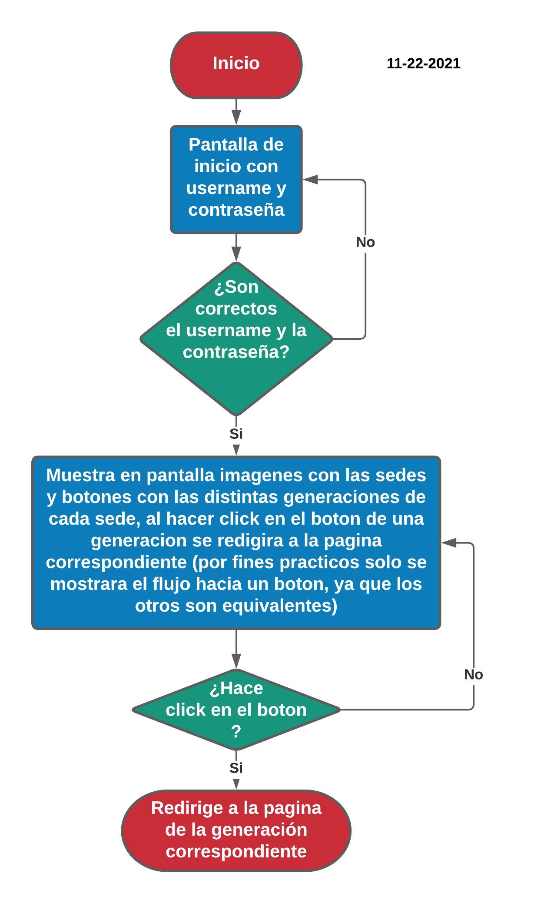
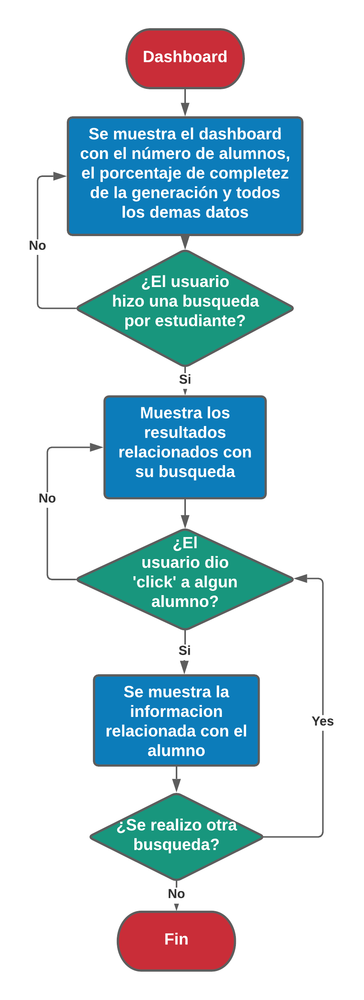
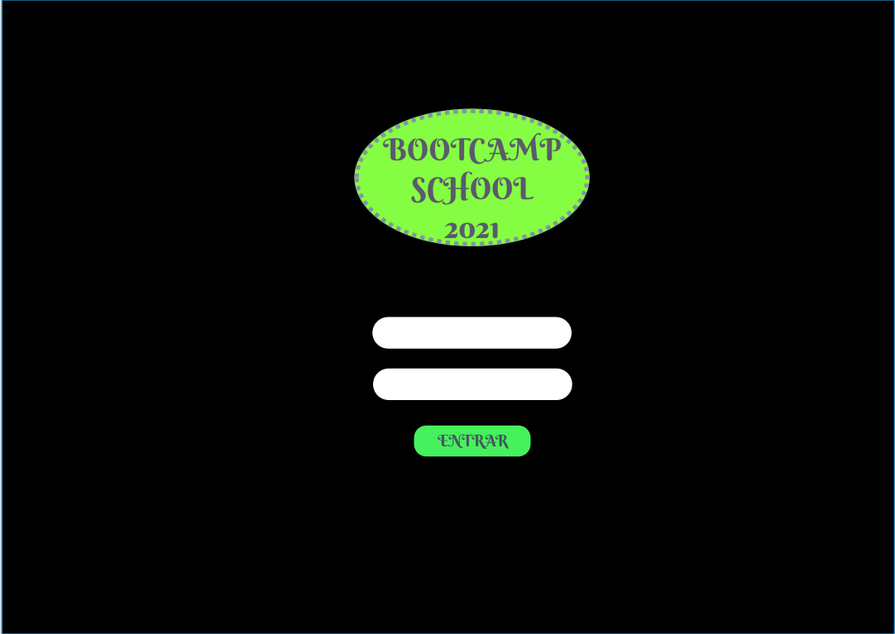
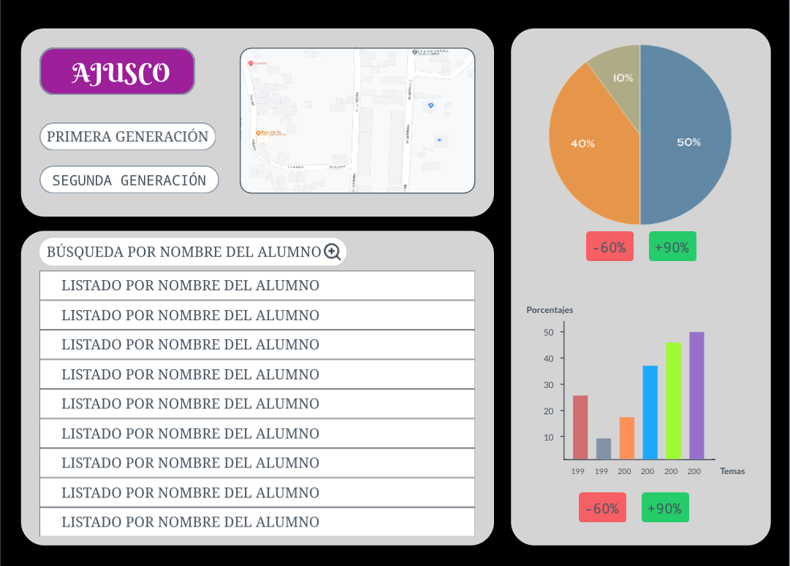

# Data Dashboard

---
Índice

    1. Descripción
    2. User Definition & User Stories (UX)
    3. Diagrama de flujo
    4. Sketch 
    5. Producto

---

## 1. Descripción

Aplicación web para la visualización y manipulación de datos de los alumnos inscritos en Coding Bootcamp School, especialente para la visualización del progreso de los temas vistos.

---

## 2. User Definition:

El cliente es el director y los docentes del Bootcamp School 2021, quienes buscan visualizar de manera sencilla los datos de todos sus alumnos, principalmente la sede a la que pertenecen, la generación y los temas que se deben reforzar. 
La solución es un control de mando de datos, Data Dashboard, que les permita visualizar y manipular esta información de manera rápida y sencilla desde los principales dispositivos móviles.

## User Stories (UX):

- El usuario debe poder entrar a la aplicación web atravez de culquier dispositivo, smarthphone, tablet, laptop o computadora de escritorio. 
- El usuario podrá entrar a la aplicación haciendo logIn con su ID y Contraseña.
- El usuario podrá elegir entrelas 3 sedes diferentes.
- El usuario podrá visualisar de manera individual cada sede. 
   - El usuario podrá elegir la generación de alumnos.
   - El usuario podrá buscar por el nombre del alumno.
   - El usuario podorá visualizar de manera general la base de datos de alumnos con el 60% o menos del 60% de los temas completados.
   - El usuario podrá visualizar de manera general la base de datos de alumnos con 90% o más de los temas completados.
   - El usuario podrá visualizar de manera individual, por alumno, los temas y subtemas así como su porcentaje completado  tiempo que este le llevó.

---

## 3. Diagrama de flujo 

* Diagrama de flujo del LogIn

* Diagrama de flujo del Data Dashboard

---

## 4. Sketch 

* Pantalla inicial de LogIn.

* Segunda pantalla de Sucursales.

* Tercer pantalla de visualización de datos y gráficas.

---

## 5. Producto

* Aquí la liga del producto terminado:

---

