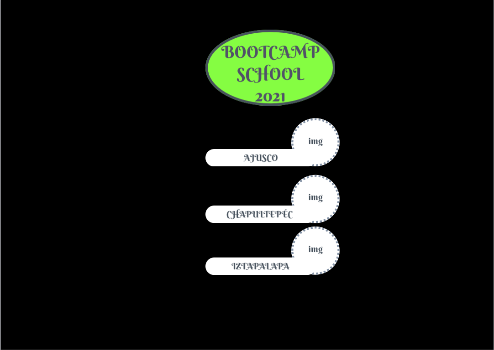

# Data Dashboard
---

---
Índice

    1. Description
    2. User Definition & User Stories (UX)
    3. Diagrama de flujo
    4. Maquetado 
    5. Hacker edition
    6. Expected Learning Outcomes
---

## 1. Description
Web Application to see a Data Dashboard to show the students information data of a Coding Bootcamp School specially the  students progress on the study platform.
## 2. User Definition:
**User: Headmaster bootcamp school to analyze and interpret the data of the students**
## User Stories:

The interface should allow the user:
* Show a login with the Bootcamp School logo for the school headmaster.
* Have a first view listing the 3 locations of Bootcamp school and by clicking on each showing the branch page.
* Show the info only for that branch on this separated view, this view should have the name of branch and a piture of the location as well, show also the generations available to click on and find the students registered for each generation.
  * For each generation:
  * Show how many students were registered in cards
  * Filter and be able to search for students by name
  * Show generation percentage average of progress of completion
  * Show to indentify students with bellow 60 percentage
  * Show to identify students with 90 or more of competion percentage.
  * List and be able to select students showing general percentage of completion of each student, ordered by name alphabetically.
    * For each student:
    * Be able to click on to show progress report:
      * Show percent complete for all topics
      * Calculate percentage of time completed for each topic
      * List subtopics for each topic
      * Ability to filter completed and non-completed subtopics of each topic
      * Be able to filter subtopics by type (exercises, readings and quizzes)
## 3. Acceptance Criteria
* Use the interface without problems from different screen sizes: mobiles, tablets, desktops
* Perform unit tests for "pure functions"
* Cover all the US
* Hacker Edition
---

## 4. Maquetado /

Pantalla inicial de LogIn.

Segunda pantalla de Sucursales.

Tercer pantalla de visualización de datos y gráficas.

---

### Scripts / Files

* `README.md`: should explain how to download, install and run the application as well as an introduction to the application, its functionality and decisions about design they took.
* `assets /`: Should contain your assets like images, logos, etc.
* `src / index.html`: this is the entry point to your application. This file must contain to _markup_ (HTML) and include the necessary CSS and JavaScript for index.js module.
* `src / app.js`: here you must implement the web application main functionality to manipulate the data coming from data.js
* `src / data.js`: here you must fetch/get the data from the local JSON and then export it to be used in the app.js module.
* `src / index.js`: here you must listen to DOM events, like create and add events to the DOM and get the search values to be processed to app.js.
* `test / app.spec.js`: this file contains some sample tests and here you will have to implement the tests.

**CLUES:**

You have to identify first the data types that are content on the json and know how to access to it, if is an array, an object, an string. Identify the json data structure and determine how to iterate it to access into.

- [Use a JSON viewer browser extension to see the data magically ordered](https://chrome.google.com/webstore/detail/json-viewer/gbmdgpbipfallnflgajpaliibnhdgobh)
- [Check the array iteration methods](https://www.youtube.com/watch?v=Urwzk6ILvPQ)
- [Check the object methods](https://www.youtube.com/watch?v=kL9bC-e5UeE)
- [Check the essential array methods ](https://www.youtube.com/watch?v=5yPf74sCu2k)
- [Learn how to get Multiple CSS + HTML pagination ](https://www.youtube.com/watch?v=iXSSHlOe47s)

**Additional Resources**

These are some tips that can help you in organizing and carrying out your project, taking into account the development of your _soft skills_:

* To start an organization of your project, see with what resources
  accounts and the time you have to complete it.
* If there is something that you do not know, ask and try to solve it; you can start with
  a google search, then consulting your squad and finally your coach. 
  If there is something that I do not know, someone else can help me. Learning is a
  collaborative process.
* Once you start to move forward ask for feedback, your colleagues may have
  excellent ideas or ways to solve the project that can help you.
* When you run into a problem, look for alternatives, and for that, consult
  different sources.
* If you already see yourself investing a lot of time in details, you should know how to prioritize and
  stick with the most important, projects have limited time and you must
  know how to manage it.
* Work as a team, ask questions and try to complete the project without giving up.
* Prepare your presentation, if I cannot communicate my ideas to others I do not know
  You will appreciate all the effort and work you put into it.

---

## 5. Hacker Edition

---

You are not limited to implementing only the mandatory part. You can add also other nice to have functionalities on this web application, like a alphabetic filter by names like an agenda, while clicking on each letter, should show the student data in cards as well.

---
##  6. Expected Learning Outcomes

---
- [ ] npm init 
- [ ] JSON 
- [ ] fetch() method
- [ ] promises in JavaScript 
- [ ] iterate data
- [ ] array methods and iterators
- [ ] object iterators and key finders
- [ ] import & export modules
- [ ] My first Unitary Testing
- [ ] GitHub Branch Modeling > Development > Release 

---
# ReadMe

---
> This Readme should be replaced with the project documentation following the SDLC procedures for Agile Software Development Lyfe Cycle.

